# SigVer: Siamese-CNNs for Offline Signature Verification

## Purpose

Offline signature verification is one of the most difficult tasks for forensic document examiners. Since the signatures are being scrutinized for fraud using only static images of the completed signature, a lot of crucial information for making these comparisons is lost. Forensic document examiners need methods that can generalize well to new data and detect skilled signature forgeries. This project applies Siamese CNNs with contrastive loss to distinguish forged signatures from genuine ones using the **ICDAR 2011 Signature Dataset**. 

## What are Siamese CNNs? 

So what are Siamese CNNs and how can they help solve this problem? 

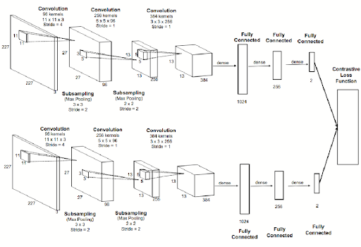

Siamese CNNs (as shown below) are two CNNs that run in parallel to each other to learn feature embeddings for images. The distance between the two embeddings were compared using contrastive loss and then those features were reused for one-shot learning to make predictions on the test data. In this project, I take a **supervised metric-based learning** approach with Siamese Convolutional Neural Networks (Siamese CNNs).

## Data

I used the offline Dutch user images from the ICDAR 2011 Signature dataset. This is a classic signature verification dataset and is used for the SigComp competition. The training set has 10 reference writers, each of whom has 12 genuine signatures and 12 skilled forgeries made for them. The test set has 54 reference writers, each with 12 genuine and 12 corresponding skilled forgeries. This gives a total of 362 training set signatures and 1932 test set signatures. 

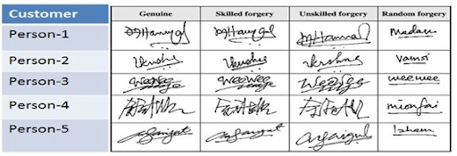

Here is a table with examples of the different kinds of forgeries. A "skilled forgery" is one by a criminal who has practiced to replicate the true signature in a way that looks accurate and fluent. An "unskilled forgery" is made by tracing over the genuine signature, typically with high accuracy but low fluency. The random forgery is made with no prior knowledge of the actual signature, only the name of the individual. 

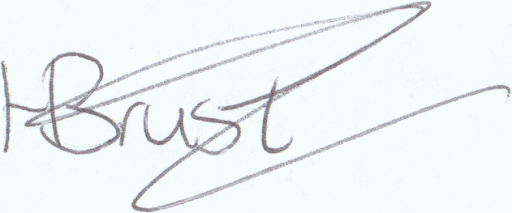  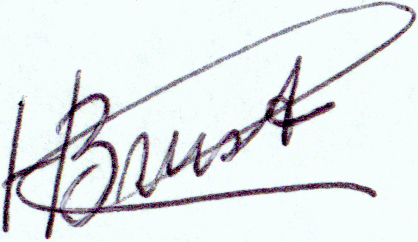

Upon doing some initial exploratory data analysis, I discovered that a lot of the images had varying sizes, varying background and pen colors, varying intensity (how hard the pen was pushed to paper, shown by darkness of writing), and were all very closely cropped to the signatures. There are also differences in the lighting and contrast of the pictures.

## Preprocessing

In order to be able to produce highly accurate results from these image comparisons, this verification system relies heavily on meticulous and intentional image preprocessing steps. Some examples would be: image scaling, resizing, cropping, rotation, filtering, histogram of oriented gradients thresholding, hash tagging, and more.

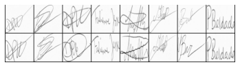

For the current version, I kept the preprocessing steps very simple. The first thing that I did was to resize all of the images to be 105 pixels x 105 pixels. Making sure all of the images are the same size is crucial to designing the neural nets, because the inputs for each neural net have to be **identical to each other** and **2D arrays of an expected size**. I also wanted to make sure that any color variations in the training dataset images would not be a problem, so I converted all the images to grayscale. 

## Feature Vector Extraction

The Siamese network was constructed to take inputs of image pairs and calculate embeddings for each image in the pair. Since there are natural variations in genuine signatures and I need a model that can not only tell apart forgeries, but can generalize well to never before seen signatures, I need to be able to extract **discriminative features**. Discriminative features can be used to distinguish between two different people’s signatures. This now becomes a **metric learning problem**, as the deep learning model is not looking for a hyperplane to separate images, but is trying to reorganize the input space in a way that brings similar samples together and distances dissimilar samples.

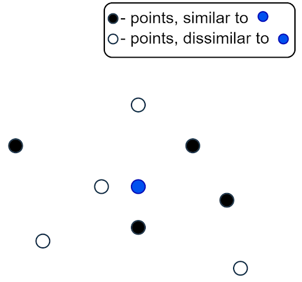  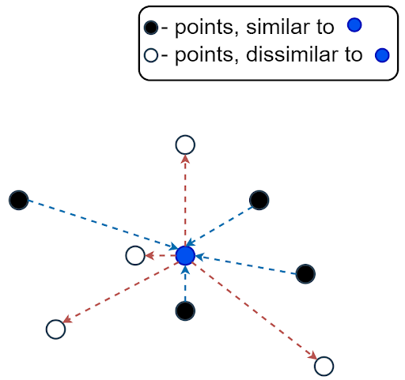

The features used here are static, since they come from images of the signatures without real-time activity monitoring. The main ones are image texture (wavelet descriptors), geometry and topology (shape, size aspect ratio etc.), stroke positions, hand writing similarity etc.

## Loss Function

During the training process, the image pair embeddings were compared using the contrastive loss function that Yann LeCun proposed in 2005.

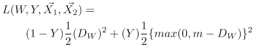

The function says that the loss is equal to the sum of the terms for the “dissimilar” cases (left-hand side) and “similar” cases (right-hand side). The contrastive loss function uses Euclidean distance (this can be any distance metric, though) to compare the embeddings. Similar samples are penalized from being distant from each other and dissimilar samples must stay outside the “margin”. Any dissimilar samples that are closer than the set margin distance are penalized by the model. 

## Similarity Score Calculation

To make comparisons of “similar” or “dissimilar”, there must be some method of calculating similarity scores. The similarity scores for this project were calculated using the Euclidean distance. 

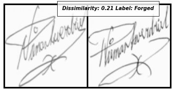  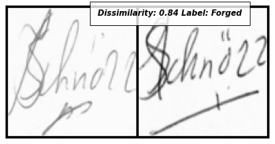

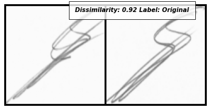  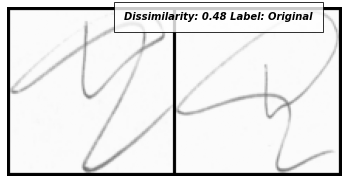  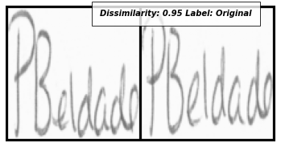

Some of the forgeries had higher dissimilarity to the originals than others. This illustrates the difference between skilled and unskilled forgeries. Most commonly, the genuine-genuine signature pairs had lower dissimilarity than the genuine-forged signature pairs. However, there are plenty of cases where the signatures are both genuine, but have very high dissimilarity between them, and this can be due to many different factors. 

## Optimizer

Root Mean Square Propagation, which is a gradient descent optimization algorithm, was used to optimize the model during training. The great feature of this optimizer is that if there is a parameter with a disproportionately large cost to the loss function, this optimizer penalizes that parameter in a way that prevents the algorithm from adapting to changes in that parameter too quickly compared to changes in the other parameters. One downside is that the learning rate and other hyperparameters need to be manually set beforehand, and the out of the box learning rate doesn’t work well for all cases. 

Parameters used for RMSProp: _lr=1e-4, alpha=0.99, eps=1e-8, weight_decay=0.0005, momentum=0.9_

## One-Shot Learning

The goal of one-shot learning is to have the model learn concepts from either one or few training examples. Thus, the pre-trained model was loaded and used on the test dataset to extract feature vectors and make predictions based on the dissimilarity. The resulting model accuracy was 51%, which is to be expected due to the rather simple image preprocessing steps. Performance can be significantly improved with some changes to the preprocessing pipeline and further optimization.

## Discussion 

Making a generalized model is very difficult, since a person's signature can differ from day to day, or instance to instance, depending on a number of factors such as age, illness, emotional state, and more. These cases must be accounted for in the model creation and optimization process. 

Currently, the model seems to be having problems with the more “complex” signatures. Looks like the more strokes there are in the signature, and the closer together the strokes are, the easier it is for the model to make mistakes.

The main improvements for this model would be:

1) More meticulous image preprocessing steps: normalize, invert the black and white images, salt pepper noise removal, slant normalization, filtering methods, etc.

2) Data augmentations to increase training image diversity (ex. flip, rotate, change contrast, scaling, etc.)

3) Use triplet loss instead of contrastive loss. Since there were many mixed cases in the data, contrastive loss may not be the best option for the loss function, or possibly, Euclidean distance may not be the best distance metric to use for this problem. Triplet loss may be a better choice over contrastive loss.

4) Increase the number of training epochs. I had reduced the number of training epochs to 10 epochs due to computational resource limits. 

## Acknowledgments
Thank you to my mentor, Ricardo, for your consistent support and encouragement throughout this project.

## References
1) https://medium.com/@subham.tiwari186/siamese-neural-network-for-one-shot-image-recognition-paper-analysis-44cf7f0c66cb
2) https://arxiv.org/pdf/1707.02131.pdf
3) https://hackernoon.com/one-shot-learning-with-siamese-networks-in-pytorch-8ddaab10340e
4) https://www.cs.cmu.edu/~rsalakhu/papers/oneshot1.pdf
5) http://cs231n.stanford.edu/reports/2017/pdfs/801.pdf
6) https://towardsdatascience.com/signature-fraud-detection-an-advanced-analytics-approach-a795b0e588b2
